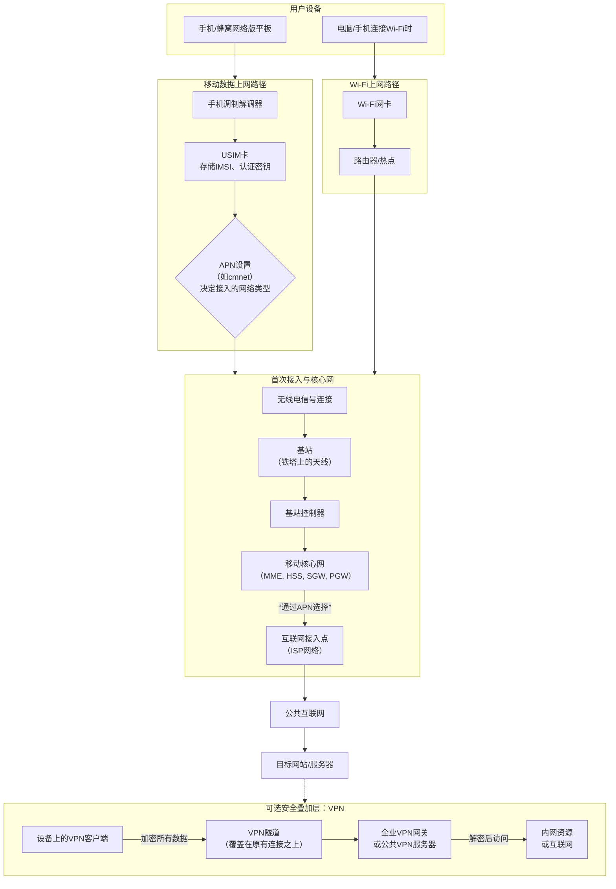

# APN

## APN 与移动网络的连接流程（简化版）

1. 手机开启移动数据 → 向运营商网络发送连接请求，附带 APN 配置。
2. 运营商的核心网（SGSN/MME）收到 APN → 通过 DNS 解析找到对应的网关（GGSN/PGW）。
3. 网关根据 APN 决定：
    * 连接公网互联网（普通上网）
    * 连接企业专网（私有 APN）
    * 分配 IP、QoS（服务质量）、计费规则等

连接成功 → 手机获得 IP 地址，开始上网。

| 作用             | 说明                                                                 |
|------------------|----------------------------------------------------------------------|
| 标识接入路径     | 告诉运营商的网关（GGSN/PGW）设备要连接哪个外部网络（如互联网、MMS、WAP、企业专网等） |
| 分配 IP 地址     | 决定设备获得公网 IP 还是私网 IP，以及 IP 地址类型（动态/静态）       |
| 决定服务类型     | 区分普通上网、MMS、多媒体消息、定位服务等                           |
| 控制安全与路由   | 私网 APN 可实现数据直连企业内网、加密传输、防火墙隔离等             |
| 运营商区分       | 每个运营商的 APN 不同（如中国移动常用 cmnet、cmwap，中国联通 3gnet、uniwap，中国电信 ctnet、ctwap） |

没有正确的 APN 配置 → 无法使用移动数据（即使信号满格）。APN 是移动网络数据服务的“入口”，直接决定了设备能访问什么网络、速度、安全性、计费方式。大多数情况下，插入 SIM 卡后手机会自动配置正确的 APN（运营商推送），但换卡、换设备、用物联网卡、去国外漫游、需要专网时，可能需要手动设置或修改。

